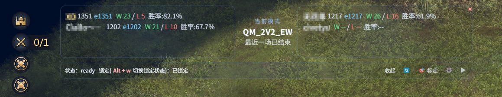
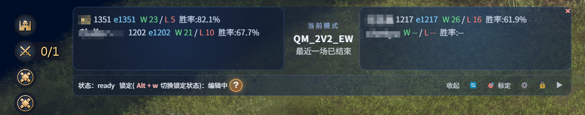
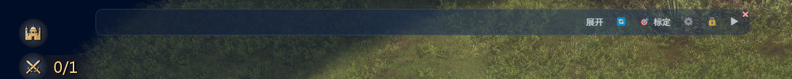

# AoE4 HUD

这是一个帝国时代4桌面 HUD 覆盖层前端。  
它会在游戏画面上方显示关键信息，并和本地后端联动，帮助你在对局中更快做出判断。
该项目以及后端项目受到以下项目的启发：
https://github.com/aoe4world/overlay  
https://github.com/FluffyMaguro/AoE4_Overlay  

## 这个项目可以用来干嘛

- 在游戏上方显示 HUD 信息，不需要频繁切屏查询如aoe4world网站
- 展示双方对局信息（如胜率、排位分等）
  
- 支持收起与锁定模式，不影响游戏内操作。  
编辑模式下有背景色，锁定后变为透明。  
  
  
- 提供可视化标定向导，配置识别区域，以便于后端识别数据，并以此为依据来为你做出提醒，如有闲置村民时提醒、资源配比有问题时提醒、时间段提醒等。  
  
- 与本地后端实时通信，展示识别状态与提醒事件

## 主要能力

- Electron + Vue3 构建的 AoE4 Overlay 界面
- 锁定 / 编辑 两种工作状态切换
- ROI 标定与本地配置持久化
- 前端直连 AoE4World 拉取玩家最近对局信息
- 通过 WebSocket 与后端交互

## 未实现功能  
- 本项目为自用项目，目前未实现含有额外资源类型的民族，如拜占庭、马其顿等的数据标定提醒功能。
## 开发运行环境

- Windows 10/11
- Node.js 18 及以上
- 识别功能需要配合本地后端服务一起使用（默认后端地址：`ws://127.0.0.1:8765`）

## 安装依赖

在项目根目录执行：

```powershell
npm install
```

## 启动项目

开发模式：

```powershell
npm run dev
```

打包 Windows 安装包：

```powershell
npm run pack:win
```

## 开发环境快速使用步骤

1. 先启动后端服务(如需使用识别功能)。
2. 启动本前端项目。
3. 在设置面板填写玩家信息与后端地址。
4. 进入标定向导完成 ROI 标定并保存。
5. 连接后端后开始识别，在 HUD 中查看状态与数据。
6. 对局中可以切换到锁定模式，避免影响游戏操作。

